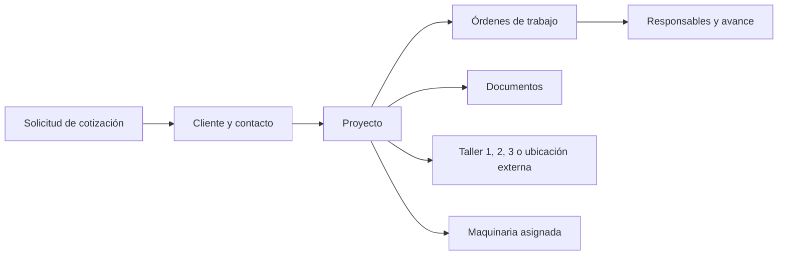

# Sistema interno de Grupo Industrial DOXA

## Alcance inicial

La primera versión será privada y solo permitirá entrar a empleados invitados. El sitio público seguirá separado; el panel interno se construirá en una ruta o aplicación propia después de conectar Supabase.

### Módulos del MVP

1. **Usuarios y roles:** administrador, gerente, personal y consulta.
2. **Clientes:** razón social, RFC, datos generales y estado.
3. **Contactos:** personas asociadas a cada cliente.
4. **Ubicaciones de trabajo:** Taller 1, Taller 2, Taller 3 o una ubicación externa como instalaciones del cliente, playa u obra.
5. **Proyectos:** servicio, responsable, fechas, presupuesto y estado.
6. **Solicitudes de cotización:** captura y seguimiento del prospecto hasta convertirlo en proyecto.
7. **Órdenes de trabajo:** actividades asignadas dentro de cada proyecto.
8. **Equipos:** maquinaria disponible y asignación de uno o más equipos a cada proyecto.
9. **Documentos opcionales:** cotizaciones, contratos, órdenes de compra, planos, evidencia fotográfica, reportes de inspección o seguridad y facturas.

## Seguridad

- Supabase Auth administrará las sesiones.
- No habrá registro público; un administrador invitará a cada empleado.
- Todas las tablas tendrán Row Level Security (RLS).
- El rol `anon` no tendrá acceso a ninguna tabla interna.
- Los empleados activos podrán consultar la información interna.
- Solo administradores y gerentes podrán crear, modificar o eliminar registros maestros.
- El rol `staff` podrá actualizar proyectos y órdenes de trabajo, asignar maquinaria y cargar evidencia, pero no administrar usuarios.
- La `service_role` nunca se incluirá en el frontend.

## Flujo inicial

## Decisiones antes de construir pantallas

- Conseguir el correo de acceso de cada empleado para crear sus invitaciones en Supabase Auth.
- Confirmar el nombre o descripción con el que se identificarán los tres talleres.
- Reunir uno o dos ejemplos reales de cliente, proyecto y orden de trabajo para validar los campos.
- Definir qué documentos se guardarán y cuánto espacio aproximado requieren.
- Conectar `/api/quote` para que cada solicitud se guarde automáticamente en `quote_requests`, conservando el correo actual como notificación.

## Archivos técnicos

La migración inicial está en `supabase/migrations/202609280001_initial_internal_system.sql`. No debe ejecutarse en producción hasta crear el proyecto de Supabase y revisar los campos con DOXA.
